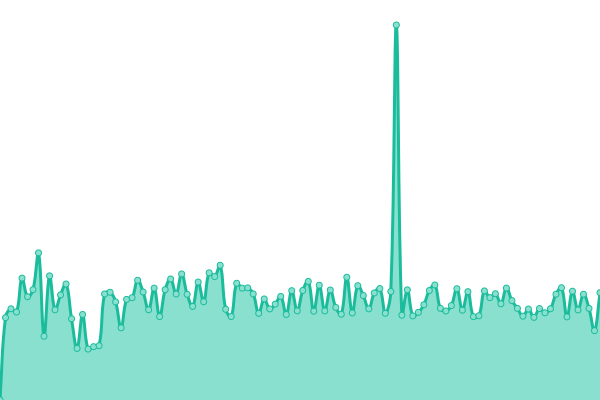

# [📈 Live Status](https://uptime.stakr.space): <!--live status--> **🟩 All systems operational**

This repository contains the open-source uptime monitor and status page for [stakr.space](https://stakr.space), powered by [Upptime](https://github.com/upptime/upptime).

With [Upptime](https://upptime.js.org), you can get your own unlimited and free uptime monitor and status page, powered entirely by a GitHub repository. We use [Issues](https://github.com/stakrspace/upptime/issues) as incident reports, [Actions](https://github.com/stakrspace/upptime/actions) as uptime monitors, and [Pages](https://uptime.stakr.space) for the status page.

<!--start: status pages-->
<!-- This summary is generated by Upptime (https://github.com/upptime/upptime) -->
<!-- Do not edit this manually, your changes will be overwritten -->
<!-- prettier-ignore -->
| URL | Status | History | Response Time | Uptime |
| --- | ------ | ------- | ------------- | ------ |
|  [STAKR.space site](https://stakr.space) | 🟩 Up | [stakr-space-site.yml](https://github.com/stakrspace/upptime/commits/HEAD/history/stakr-space-site.yml) | 

 2455ms
     
 | 

<a href="https://uptime.stakr.space/history/stakr-space-site">84.73%</a>
    

|  [Mainnet Explorer](http://explorer.stakr.space) | 🟩 Up | [mainnet-explorer.yml](https://github.com/stakrspace/upptime/commits/HEAD/history/mainnet-explorer.yml) | 

 770ms
     
 | 

<a href="https://uptime.stakr.space/history/mainnet-explorer">100.00%</a>
    

|  [Testnet Explorer](http://testnet.explorer.stakr.space) | 🟩 Up | [testnet-explorer.yml](https://github.com/stakrspace/upptime/commits/HEAD/history/testnet-explorer.yml) | 

 607ms
     
 | 

<a href="https://uptime.stakr.space/history/testnet-explorer">100.00%</a>
    

|  [Networks Information](http://networks.stakr.space) | 🟩 Up | [networks-information.yml](https://github.com/stakrspace/upptime/commits/HEAD/history/networks-information.yml) | 

 447ms
     
 | 

<a href="https://uptime.stakr.space/history/networks-information">99.63%</a>
    

<!--end: status pages-->

[**Visit our status website →**](https://uptime.stakr.space)

## 📄 License

- Powered by: [Upptime](https://github.com/upptime/upptime)
- Code: [MIT](./LICENSE) © [stakr.space](https://stakr.space)
- Data in the `./history` directory: [Open Database License](https://opendatacommons.org/licenses/odbl/1-0/)
